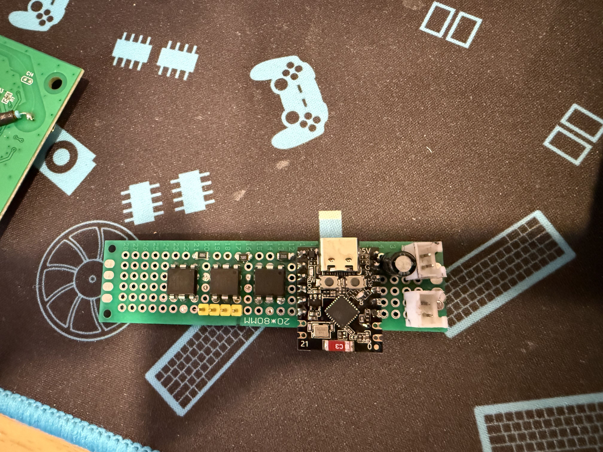
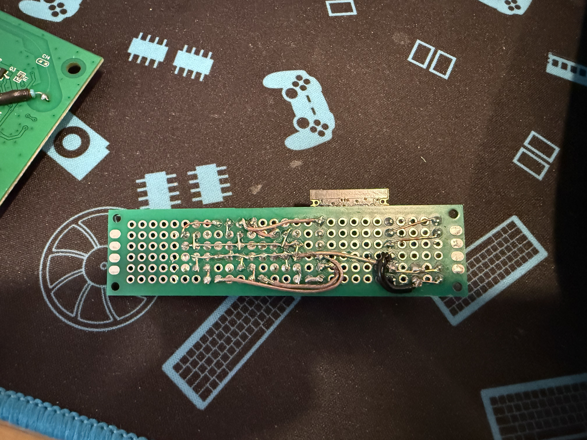
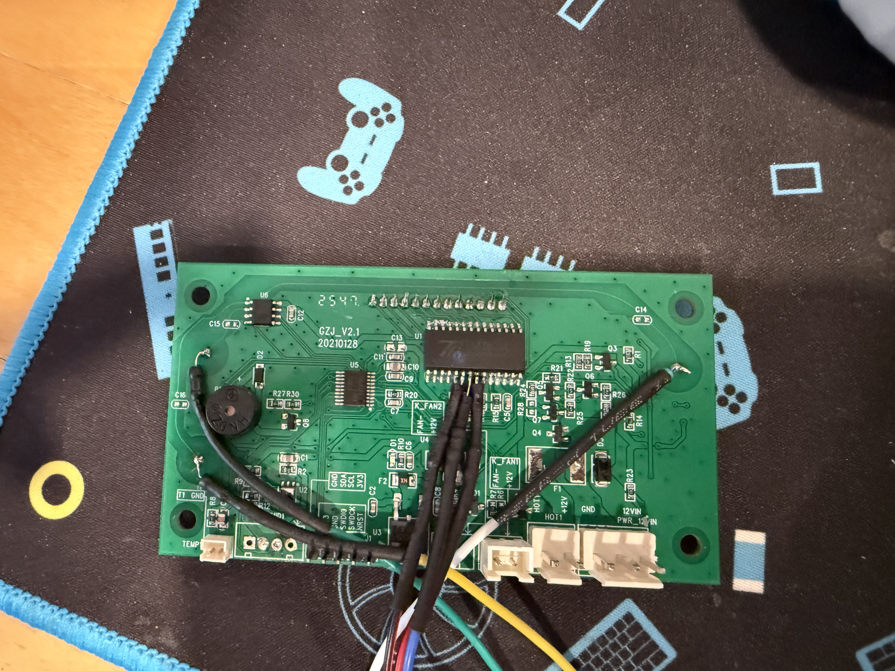

# DragonWheeze — Hardware / Wiring

A small daughter board that piggybacks the Sovol SH01 mainboard. It's **inspired by
[SimplyMaker's](https://simplymaker.net/electronics/easily-integrate-sovol-filament-dryer-to-home-assistant-with-esp32/)
optocoupler approach**, with two changes of our own:

- **Reads the screen, not I²C** — temp / humidity / time are decoded **passively off the
  TM1621C LCD driver**, so the mainboard's sensor bus is never touched (no `E0`).
- **Grounds the optocoupler LED cathode (pin 2)** so the LED lights and the opto fires.

## Bill of materials

| Qty | Part | Value / spec | Purpose |
|---|---|---|---|
| 1 | ESP32-C3 Super Mini | — | MCU + Wi-Fi; runs DragonWheeze |
| 3 | 4N35 optocoupler | DIP-6 | isolated presses on the Power / Mode / Adjust pads |
| 3 | Resistor | 200 Ω (1206) | 4N35 LED current-limit, GPIO side |
| 3 | Resistor | 100 kΩ | in series, 4N35 output → touch pad |
| 3 | Resistor | 3 kΩ | series on the LCD sniff taps (CS / WR / DATA) |
| 1 | Mini360 buck converter | 12 V → 5.8 V (or 3.3 V) | power the ESP off the dryer's 12 V rail |
| 1 | Capacitor | 100 µF electrolytic | decouple ESP power at the buck output |
| 1 | Perfboard | 20 × 80 mm | daughter-board substrate |
| a few | JST-XH connectors | 2 / 3-pin | service-disconnect pigtails (LCD taps, pads, power) |
| — | Hookup wire | ~30 AWG | tap leads to the mainboard points |

## Connections

| Net | Path |
|---|---|
| GPIO3 | → 3 kΩ → TM1621C pin 6 (`/CS`) — listen only |
| GPIO10 | → 3 kΩ → TM1621C pin 7 (`/WR`) — listen only |
| GPIO4 | → 3 kΩ → TM1621C pin 8 (`DATA`) — listen only |
| GPIO5 | → 200 Ω → 4N35 pin 1; **pin 2 → GND**, pin 5 → GND, pin 4 → 100 kΩ → **Power pad** |
| GPIO6 | same channel → **Mode pad** |
| GPIO7 | same channel → **Adjust pad** |
| Power | dryer 12 V → Mini360 → ESP (**3.3 V → `3V3` pin**, or ~5.8 V → `5V` pin) |

**Grounding:** tie every ground — both 4N35 grounds (pins 2 & 5), the ESP `GND`, and the
buck return — to a single point: the **negative (−) terminal of the 100 µF cap**.

> Pin roles match [`components/dw_board/include/dw_board.h`](../../components/dw_board/include/dw_board.h)
> at `v2.0.0` (optos P/M/A = GPIO5/6/7; taps CS/WR/DATA = GPIO3/10/4). Confirm the 4N35 pin
> numbers and the exact TM1621C package pins against your own board before building.

## The build

| Component side | Solder side |
|---|---|
|  |  |

*SH01 mainboard (GZJ_V2.1) — the TM1621C (U1) LCD driver and the fine tap wires for CS / WR / DATA.*
